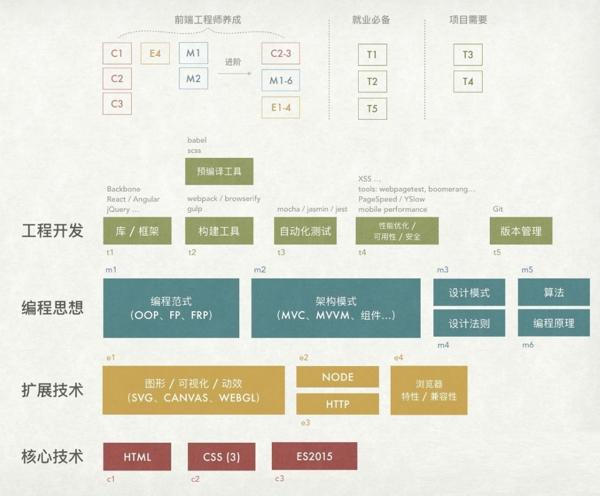
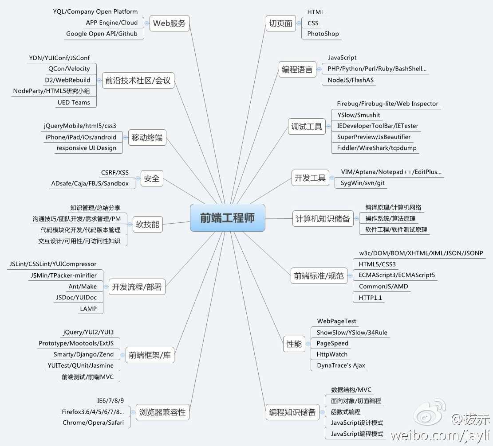

# 说明

平时的学习资源都比较的凌乱，看到好的资源都是直接收藏在浏览器的收藏夹中，这样其实并不方便，整理在云笔记上，也不方便查看修改记录，索性就整理在 github 上并开源出来，希望帮助大家能够更快的找到需要的资源。建立该仓库的目的主要是整理收集学习资源，统一管理，方便随时查找。

目前整合的学习资源只是前端方向的，可能会存在漏缺比较好的资源，需要慢慢的完善它，欢迎在该 **[dicuss issue](https://github.com/webproblem/learning-article/issues/1) 上补充资源或者交流意见**。

**觉得有帮助的话，请点击右上角 Watch ， Star ， Fork，也可以 follow 我关注更多信息**

目录

* [面试资源](./面试资源.md)

* [项目资源](./收集的项目资源.md)

* [知识锦集](./知识锦集.md)

* [前端早读课文章](./前端早读课.md)

* [Vue 相关](#vue)

* [React 相关](#react)

* [Javascript 函数式编程](#javascript-函数式编程)

* [TypeSctipt](#typescript)

* [webpack](#webpack)

* [Parcel](#parcel)

* [Gulp](#gulp)

* [es系列](#es系列)

* [Babel](#babel)

* [http 请求库](#http-请求库)

* [Promise](#promise)

* [NodeJS](#nodejs)

* [MongoDB](#mongodb)

* [Git](#git)

* [移动端](#移动端)

* [可视化工具](#可视化工具)

* [提高生产力工具](#提高生产力工具)

* [Python](#python)

* [PWA](#pwa)

* [Flutter](#flutter)

* [GraphQL](#graphql)

* [机器学习](#机器学习)

* [Chrmoe](#chrome)

* [其他](#其他)

* [博客/社区](#博客社区)

* [业界技术交流会](#业界技术交流会一年一度的持续性的交流会)

* [Github资源](#github资源)

## vue

### 文档

* [Vue 官方文档](https://cn.vuejs.org/v2/guide/)

* [Vuex 文档](https://vuex.vuejs.org/zh-cn/)

* [vue-router 文档](https://router.vuejs.org/zh-cn/index.html)

* [vue-loader 文档](https://vue-loader.vuejs.org/zh-cn/)

* [Vue.js 服务器端渲染指南](https://ssr.vuejs.org/zh/)

* [Nuxt.js 文档](https://zh.nuxtjs.org/guide)

* [Vue 1.0 中文文档](https://v1-cn.vuejs.org/guide/)

* [Vue 驱动的静态网站生成器](https://vuepress.vuejs.org/zh/)

* [Vue CLI](https://cli.vuejs.org/)

### UI 库

* [有赞 Vue UI 库 vant](https://github.com/youzan/vant)

* [cube-ui](https://didi.github.io/cube-ui/#/zh-CN/docs/introduction)

* [Mint UI](http://mint-ui.github.io/#!/zh-cn)

* [vonic UI 框架](https://github.com/wangdahoo/vonic)

* [element UI](http://element.eleme.io/#/zh-CN)

* [iview UI](https://www.iviewui.com/)

* [vue-antd-ui](https://github.com/vueComponent/ant-design)

### 源码

* [Vue.js 源码学习笔记](http://jiongks.name/blog/vue-code-review/)

* [Vue.js 源码解析](https://github.com/answershuto/learnVue)

* [剖析vue实现原理，自己动手实现mvvm](https://github.com/DMQ/mvvm)

* [Vue.js 技术揭秘](https://github.com/ustbhuangyi/vue-analysis)

* [Vue.js 逐行级别的源码分析](https://github.com/HcySunYang/vue-design)

### 相关

* [Vue.js 中文社区](https://www.vue-js.com/)

* [Vue相关开源项目库汇总-总结得很详细](https://github.com/opendigg/awesome-github-vue)

## React

### 文档

* [React 文档](https://doc.react-china.org/)

* [react-router 文档](http://react-guide.github.io/react-router-cn/docs/Introduction.html)

* [redux 文档](http://cn.redux.js.org/)

* [React 模式](http://sangka-z.com/react-in-patterns-cn/)

* [mobx 文档](https://cn.mobx.js.org/)

* [React.js 小书](http://huziketang.mangojuice.top/books/react/)

### UI 库

* [ant-design](https://github.com/ant-design/ant-design/)

* [ant-design-mobile](https://github.com/ant-design/ant-design-mobile/)

* [ant-motion 动画框架](https://github.com/ant-design/ant-motion)

* [Zent](https://youzan.github.io/zent/zh/guides/install)

### 相关

* [Nerv-京东高性能前端框架](https://github.com/NervJS/nerv)

## Javascript 函数式编程

* [JS 函数式编程指南](https://llh911001.gitbooks.io/mostly-adequate-guide-chinese/content/)

* Underscore

  * [Underscore 源码分析](https://yoyoyohamapi.gitbooks.io/undersercore-analysis/content/)

  * [underscore-1.8.3.js 源码解读](https://github.com/hanzichi/underscore-analysis)

    

## Typescript

* [Typescript 文档](https://www.tslang.cn/)

* [TypeScript Handbook（中文版）](https://zhongsp.gitbooks.io/typescript-handbook/content/)

* [Awesome TypeScript](https://github.com/semlinker/awesome-typescript)

* [深入理解 TypeScript](https://jkchao.github.io/typescript-book-chinese/)

## webpack

* [webpack 文档](https://doc.webpack-china.org/)

* [webpack 中文文档(v3.5.5)](http://www.css88.com/doc/webpack/)

* [深入浅出 Webpack](http://webpack.wuhaolin.cn/)

* [入门Webpack，看这篇就够了](https://www.jianshu.com/p/42e11515c10f)

* [webpack 优秀中文文章](https://github.com/webpack-china/awesome-webpack-cn)

### 源码

* [Webpack 源码解析](https://github.com/lihongxun945/diving-into-webpack)

* [Webpack揭秘——走向高阶前端的必经之路](https://juejin.im/post/5badd0c5e51d450e4437f07a)

## Parcel

* [Parcel 文档](https://parceljs.org/)

## Gulp

* [Gulp 中文网](https://www.gulpjs.com.cn/)

## es系列

* [es6 教程](http://es6.ruanyifeng.com/)

* [《深入理解ES6》教程学习笔记](https://github.com/hyy1115/ES6-learning)

## Babel

* [Babel文档](https://babeljs.cn/)

## http 请求库

* [Axios 中文说明](https://www.kancloud.cn/yunye/axios/234845)

* [axios 中文文档翻译](https://segmentfault.com/a/1190000008470355)

* [fly : 跨平台的http请求库](https://github.com/wendux/fly)

## Promise

* [JavaScript Promise迷你书（中文版）](http://liubin.org/promises-book/)

* [Promises/A+](https://promisesaplus.com/)

* [【翻译】Promises/A+规范](http://www.ituring.com.cn/article/66566)

## NodeJS

* [Node.js 中文网](http://nodejs.cn/)

* [Koa](https://koa.bootcss.com/)

* [Koa2进阶学习笔记](https://github.com/ChenShenhai/koa2-note/)

* [Node.js 优秀学习资源汇总](https://zhuanlan.zhihu.com/p/35500767)

* [Express](http://www.expressjs.com.cn/)

* [如何正确的学习Node.js](https://github.com/i5ting/How-to-learn-node-correctly)

* [《一起学 Node.js》](https://github.com/nswbmw/N-blog)

* [七天学会NodeJS](https://github.com/nqdeng/7-days-nodejs)

* [Node.js 包教不包会](https://github.com/alsotang/node-lessons)

* [Nodejs学习笔记以及经验总结](https://github.com/chyingp/nodejs-learning-guide)

* [《Node.js从入门到上线》](https://github.com/liuxing/node-blog)

* [《Node.js 调试指南》](https://github.com/nswbmw/node-in-debugging)

* [nodejs基础教程](https://www.geekjc.com/ebook/detail/5b9f65ce0f510f6ae689bccd/1537172650925)

## MongoDB

* [MongoDB中文网](http://www.mongodb.org.cn/)

* [mongoose中文文档](https://mongoosedoc.top/docs/index.html)

* [MongoDB Driver API](http://mongodb.github.io/node-mongodb-native/2.0/api/index.html)

* [MongoDB 可视化工具 robo3t](https://robomongo.org/)

* [MongoDB 可视化工具 adminMongo](https://github.com/mrvautin/adminMongo)

## Git

* [Git 练习](https://learngitbranching.js.org)

* [Git Book](https://git-scm.com/book/zh/v2)

* [有关 git 的学习资料](https://github.com/xirong/my-git)

## canvas

* [canvas 教程](https://www.yuque.com/airing/canvas)

## 移动端

### 技术类

* [Taro-多端统一开发框架](https://github.com/NervJS/taro)

* [Weex](https://github.com/apache/incubator-weex/)

* [react-native](https://github.com/facebook/react-native)

* [React Native 中文网](https://reactnative.cn/)

### 微信小程序

* [小程序文档](https://mp.weixin.qq.com/debug/wxadoc/dev/)

* [小程序社区](http://www.wxapp-union.com/)

* [mpvue 基于 Vue.js 的小程序开发框架](https://github.com/Meituan-Dianping/mpvue)

* [wepy 让小程序支持组件化开发的框架](https://tencent.github.io/wepy/)

* [zanui-weapp](https://github.com/youzan/zanui-weapp)

* [WeUI for 小程序](https://github.com/Tencent/weui-wxss)

* [iview-weapp](https://github.com/TalkingData/iview-weapp)

* [微信小程序开发资源汇总](https://github.com/justjavac/awesome-wechat-weapp)

### 支付宝小程序

* [官网](https://open.alipay.com/channel/miniIndex.htm)

### 快应用

* [官网](https://www.quickapp.cn/)

### 百度小程序

* [官网](https://smartprogram.baidu.com/mappconsole/main/login)

## 可视化工具

* [百度 echarts](http://echarts.baidu.com/)

* [蚂蚁金服数据可视化 AntV](https://antv.alipay.com/zh-cn/index.html)

* [BizCharts : 基于 React 技术栈的图表库](https://github.com/alibaba/BizCharts)

* [v-charts : 基于 Vue2.0 和 echarts 封装的 v-charts 图表组件](https://v-charts.js.org/)

* [D3.js](https://github.com/d3/d3/wiki/CN-Home)

## 静态站点生成器

* [docsite : 阿里一款开源站点搭建工具](https://github.com/txd-team/docsite)

* [docsify : 文档站点生成器](https://github.com/docsifyjs/docsify)

* [VuePress : Vue 驱动的静态网站生成器](https://vuepress.vuejs.org/zh/)

## 提高生产力工具

* [飞冰-让前端开发简单而友好](https://alibaba.github.io/ice) 

* [Easy Mock : 可视化模拟数据工具](https://www.easy-mock.com/)

* [EasyAPI : 简单，好用的API服务平台](https://www.easyapi.com/)

* [YAPI : 高效、易用、功能强大的API管理平台](http://yapi.demo.qunar.com/)

* [showdoc : 文档编写工具](https://github.com/star7th/showdoc)

* [标你妹啊 : 一款自动化设计标注工具](http://www.biaonimeia.com)

* [Framer : 全功能设计工具](https://www.framercn.com/)

* [Kitchen : 一款为设计者提升工作效率的 Sketch 工具集](https://kitchen.alipay.com/)

* [gka : 一款简单的、高效的帧动画生成工具，图片处理工具](https://github.com/gkajs/gka)

* [Typora : 一款强大的 markdown 编辑器](https://www.typora.io)

* [processon : 免费在线作图](https://www.processon.com/)

* [声享 : 在线制作 PPT](https://ppt.baomitu.com/)

* [VisuAlgo: 算法学习工具](https://visualgo.net/zh)

* [FSCapture : 滚屏截图软件](https://faststone-capture.en.softonic.com)

* [picpick : 一款全能的设计工具](https://picpick.app/zh/)

## 刷题网站

* [LeetCode 中文版](https://leetcode-cn.com/)

* [牛客网](https://www.nowcoder.com/)

* [codewars](https://www.codewars.com/)

## Python

* [廖雪峰 Python 教程](https://www.liaoxuefeng.com/wiki/0014316089557264a6b348958f449949df42a6d3a2e542c000)

* [Python 入门教程](https://github.com/TwoWater/Python)

## PWA

* [PWA 中文文档](http://sangka-z.com/PWA-Book-CN/)

* [LAVAS : 基于 Vue.js 的 PWA 解决方案](https://lavas.baidu.com/)

## Flutter

* [认识Flutter](https://segmentfault.com/a/1190000008825105)

* [Flutter攻略](https://segmentfault.com/blog/flutter)

* [Flutter中文网](https://flutterchina.club/)

* [Flutter 社区中文资源](https://flutter-io.cn/)

* [Dart 中文社区](https://www.dart-china.org/)

* [Dart 语言中文社区](http://www.cndartlang.com/)

## GraphQL

* [GraphQL 中文文档](http://graphql.cn/)

## 机器学习

* [机器学习速成课程](https://developers.google.cn/machine-learning/crash-course/?hl=zh-CN)

## Chrome

* [Chrome 开发者工具文档](http://www.css88.com/doc/chrome-devtools/)

* [Chrome开发者工具中文手册](https://github.com/CN-Chrome-DevTools/CN-Chrome-DevTools)

* [Chrome 插件开发简要指南](https://www.w3cschool.cn/kesyi/kesyi-m5uo24rx.html)

## 产品

* [人人都是产品经理](http://www.woshipm.com/)

## 博客/社区

### 团队博客

* [百度 EUX 团队博客](http://eux.baidu.com/)

* [百度 EFE 团队博客](http://efe.baidu.com/)

* [百度FEX 团队](http://fex.baidu.com/)

* [百度用户体验中心](http://uxc.baidu.com/)

* [百度外卖前端团队](https://zhuanlan.zhihu.com/bdwmfe)

* [京东凹凸实验室博客](https://aotu.io/)

* [京东设计中心](http://jdc.jd.com/)

* [美团点评技术团队博客](https://tech.meituan.com/)

* [饿了么前端](https://zhuanlan.zhihu.com/ElemeFE)

* [淘宝前端团队博客](http://taobaofed.org/)

* [蚂蚁数据体验技术团队博客](https://github.com/ProtoTeam/blog)

* [阿里巴巴国际UED团队](http://www.aliued.com/)

* [阿里巴巴中文站UED](http://www.aliued.cn/)

* [天猫前端](http://tmallfe.github.io/)

* [阿里达摩院](https://damo.alibaba.com/)

* [腾讯 AlloyTeam 团队博客](http://alloyteam.com/)

* [腾讯 IMWEB 团队](http://imweb.io/)

* [腾讯前端IVWEB团队](https://iv-web.github.io/)

* [TGideas-腾讯游戏官方设计团队](http://tgideas.qq.com/)

* [腾讯CDC](http://cdc.tencent.com/)

* [QQ音乐前端团队](https://www.musicfe.cn/index)

* [腾讯FERD(腾讯网研发中心)](http://qqfe.org/)

* [有赞技术团队](https://tech.youzan.com/)

* [滴滴开源平台](https://didi.github.io/)

* [滴滴DDFE博客](https://github.com/DDFE/DDFE-blog)

* [饿了么前端](https://zhuanlan.zhihu.com/ElemeFE)

* [大搜车无线团队](http://f2e.souche.com/blog/)

* [大搜车博客](https://blog.souche.com/)

* [人人网 FED 博客](https://fed.renren.com/)

* [网易用户体验中心](http://uedc.163.com/)

* [携程UED](http://ued.ctrip.com/)

* [奇虎360-奇舞团](https://75team.com/)

* [360用户体验设计中心](http://uxc.360.cn/)

* [去哪儿网大前端技术中心](https://ymfe.org/index.html)

* [今日头条技术博客](https://techblog.toutiao.com/)

* [前端俱乐部](https://feclub.cn/home)

* [JS 前端开发群月报](https://www.kancloud.cn/jsfront/month/82796)

* [丁香园前端小分队](https://dxy-f2e.github.io/blog/)

### 个人博客

* [廖雪峰博客](https://www.liaoxuefeng.com/)

* [阮一峰博客](http://www.ruanyifeng.com/blog/javascript/)

* [张鑫旭博客](http://www.zhangxinxu.com/)

* [https://yanlee26.github.io/posts](https://yanlee26.github.io/posts)

* [https://github.com/Aaaaaaaty/blog](https://github.com/Aaaaaaaty/blog)

* [https://github.com/mqyqingfeng/Blog](https://github.com/mqyqingfeng/Blog)

* [http://obkoro1.com/](http://obkoro1.com/)

* [https://yangbo5207.github.io/wutongluo/](https://yangbo5207.github.io/wutongluo/)

* [https://www.chuchur.com/](https://www.chuchur.com/)

* [kidney](https://www.cnblogs.com/kidney/)

* [http://www.taoweng.site/](http://www.taoweng.site/)

* [小剧客栈](https://www.bh-lay.com/)

* [CSS 森林](http://www.cssforest.org/)

* [汤姆大叔的博客](http://www.cnblogs.com/TomXu/)

* [https://github.com/jawil/blog](https://github.com/jawil/blog)

* [Hux Blog](https://huangxuan.me/)

* [贤心](http://www.sentsin.com/)

* [玉伯](https://github.com/lifesinger/blog)

* [月影](https://github.com/akira-cn)

* [豪情](https://github.com/jikeytang)

* [尤雨溪](https://github.com/yyx990803)

* [张云龙](https://github.com/fouber)

* [张克军](https://github.com/kejun)

* [黄轶](https://github.com/ustbhuangyi/)

* [Aresn](https://github.com/icarusion)

* [芋头君](https://github.com/xinyu198736)

* [狼叔](https://github.com/i5ting)

* [CSS魔法](https://github.com/cssmagic)

* [伍酱](http://www.wuyuying.com/blog/)

* [http://delai.me/](http://delai.me/)

* [第一届前端艺术家沙龙1群每日资讯整理](http://fe.jskou.com/)

### 社区

* [掘金](https://juejin.im/timeline)

* [掘金翻译计划](https://github.com/xitu/gold-miner)

* [segmentfault](https://segmentfault.com/)

* [博客园](https://www.cnblogs.com/)

* [前端乱炖](http://www.html-js.com/)

* [w3cschool](https://www.w3cschool.cn/)

* [w3school](http://www.w3school.com.cn/)

* [w3cplus](https://www.w3cplus.com/)

* [W3C 中国](http://www.chinaw3c.org/)

* [重庆前端社区](http://www.yufe.org/)

* [前端圈](https://fequan.com/)

* [V2EX](https://www.v2ex.com/)

* [前端头条](http://top.css88.com/)

* [伯乐在线](http://web.jobbole.com/)

* [小专栏](https://xiaozhuanlan.com/)

* [Stack Overflow](https://stackoverflow.com/)

* [大前端](http://www.daqianduan.com/)

* [众成翻译](https://www.zcfy.cc/)

* [WEB前端开发](http://www.css88.com/)

* [前端网](https://www.qdfuns.com/)

## 业界技术交流会(一年一度的持续性的交流会)

* [FEDAY 前端日](https://fequan.com/2018/)

* [腾讯 Live 开发者大会](http://2018.tlc.ivweb.io/)

* [Alloyteam Web 前端大会](https://ac.alloyteam.com/)

* [前端体验大会](http://feexp.org/shenzhen/)

* [D2 前端技术论坛](http://d2forum.alibaba-inc.com)

* [D2 开发者大会](http://d2forum.alibaba-inc.com/developer2018)

* [全球大前端技术大会](https://gmtc.geekbang.org/)

* [iWeb 峰会](http://2018.html5dw.com/)

* [CSS 大会](https://css.w3ctech.com/)

* [React 大会](https://react.w3ctech.com/)

* [IMWeb 前端大会](https://2018.imweb.io/)

* [云栖大会](https://yunqi.aliyun.com/2018/hangzhou/index)

* [前端艺术家沙龙](https://artist.alibaba.com/)

* [掘金开发者大会](https://conf.juejin.im/)

* [Vue.js 开发者大会](https://vueconf.cn/2018)

* [中国 JS 开发者大会](https://jsconfchina.com/)

## 资源

### 前端

* [免费的计算机编程类中文书籍](https://github.com/justjavac/free-programming-books-zh_CN)

* [《前端回忆录》](https://github.com/Wscats/Good-Text-Share)

* [前端入门和进阶学习笔记](https://github.com/smyhvae/Web)

* [PDF - 收集的各种资源](https://github.com/mynane/PDF)

* [你可能不知道的前端知识点](https://github.com/justjavac/the-front-end-knowledge-you-may-not-know)

* [GitHub最全的前端资源汇总仓库 ](https://github.com/helloqingfeng/Awsome-Front-End-learning-resource)

* [从零开始构建 JavaScript 技术栈](https://github.com/verekia/js-stack-from-scratch)

* [前端笔记系列](https://github.com/HongqingCao/Front-end-notes)

* [前端开发者指南 2018](https://github.com/xitu/front-end-handbook-2018)

* [30 seconds : 一些精炼的代码片段](https://github.com/30-seconds)

* [33-js-concepts : 每个 JavaSript 开发人员应该知道的 33 个概念](https://github.com/leonardomso/33-js-concepts)

* [每个 JavaSript 开发人员应该知道的 33 个概念-中文版](https://github.com/stephentian/33-js-concepts)

* [MDN 文档](https://developer.mozilla.org/zh-CN/docs/Web)

* [Awesomes](https://www.awesomes.cn/)

* [印记中文](https://www.docschina.org/)

* [GitBook 简明教程](http://www.chengweiyang.cn/gitbook/index.html)

* [Web前端导航](http://www.alloyteam.com/nav/)

* [移动端问题收集](https://github.com/RubyLouvre/mobileHack)

### 其他

* [为互联网IT人打造的中文版awesome-go](https://github.com/hackstoic/golang-open-source-projects)

* [后端架构师技术图谱](https://github.com/xingshaocheng/architect-awesome)

* [Java Core Sprout：处于萌芽阶段的 Java 核心知识库](https://github.com/crossoverJie/JCSprout)

* [【Java学习+面试指南】](https://github.com/Snailclimb/JavaGuide)

* [一些经典且高质量的电子书分享](https://github.com/threerocks/studyFiles)

* [互联网公司技术架构](https://github.com/davideuler/architecture.of.internet-product)

* [Computer Science Learning Notes](https://github.com/CyC2018/CS-Notes)

* [后台技术栈/全栈开发/架构师之路](https://github.com/frank-lam/2019_campus_apply)

