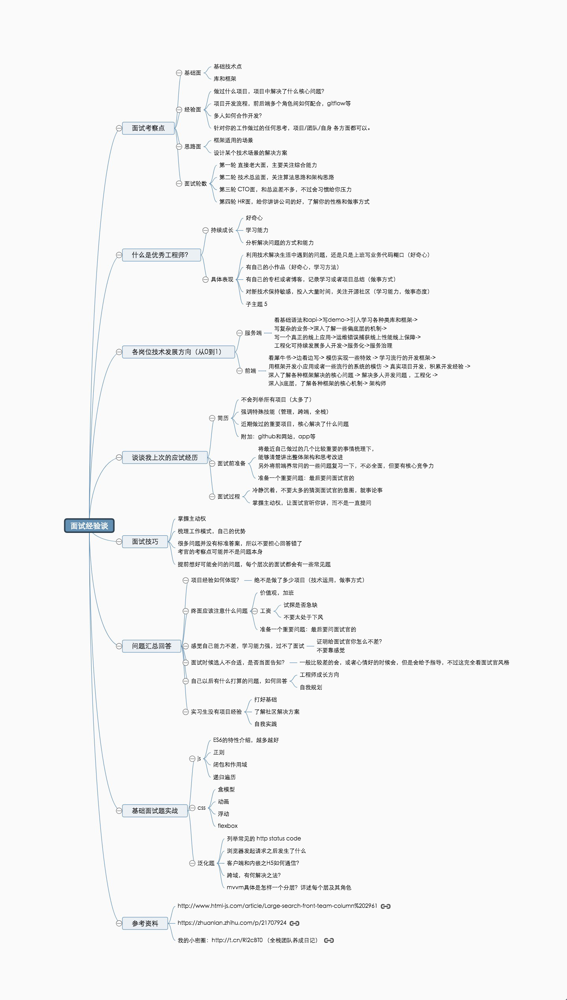

## 面试题相关

* [前端面试考点多？看这几篇文章就够了](https://juejin.im/post/5aae076d6fb9a028cc6100a9)

* [2018春招前端面试: 闯关记](https://juejin.im/post/5a998991f265da237f1dbdf9)

* [记录面试中一些回答不够好的题](https://juejin.im/post/5a9b8417518825558251ce15)

* [前端知识集锦](https://juejin.im/post/5a961d496fb9a06356314a36)

* [收集的前端面试题和答案](https://github.com/qiu-deqing/FE-interview)

* [前端开发面试题](https://github.com/markyun/My-blog/tree/master/Front-end-Developer-Questions/Questions-and-Answers)

* [前端面试题总结——综合问题](https://mp.weixin.qq.com/s?__biz=MzUzOTM0MTE4OQ==&mid=2247484010&idx=1&sn=552101d7c9476085e67aa88a5fea6850&chksm=fac8ba80cdbf33963a2cd40c5c597098d39a5566c23865550780a0df0b8c57eb6bf88c5b0fc3&scene=21#wechat_redirect)

* [面试图谱](https://github.com/InterviewMap/CS-Interview-Knowledge-Map)

* [记一次凉凉的小米面试](https://juejin.im/post/5b4d543ce51d4519610dea67)

* [前端工作面试问题](https://github.com/h5bp/Front-end-Developer-Interview-Questions/tree/master/Translations/Chinese)

* [前端面试手册](https://github.com/yangshun/front-end-interview-handbook/blob/master/Translations/Chinese/README.md)

* [前端基础面试题(JS部分)](https://zhuanlan.zhihu.com/p/28428367)

* [新鲜出炉的8月前端面试题-2018](https://segmentfault.com/a/1190000015916686)

* [Node.js 面试](https://github.com/ElemeFE/node-interview)

* [一点感悟：当走完所有大厂的实习面试后](https://juejin.im/post/5b68f384f265da0fa00a3df0)

* [总结了17年初到18年初百场前端面试的面试经验(含答案)](https://segmentfault.com/a/1190000015591521)

* [前端面试&笔试&错题指南](https://github.com/forrany/Web-Project)

* [技术面试需要掌握的基础知识整理(偏后端，可以了解下)](https://github.com/CyC2018/Interview-Notebook)

* [前端面试常考问题整理](https://github.com/poetries/FE-Interview-Questions)

* [记一次前端大厂面试](https://juejin.im/post/5b9770056fb9a05d2f3692ce)

* [百度阿里网易大疆等大小厂前端校招面经](https://juejin.im/post/5bb470295188255c5e66f88f)

* [19秋招面经](https://juejin.im/post/5b5193e6e51d4519133fa700)

* [19秋招面经续](https://juejin.im/post/5b7432076fb9a009820daa37)

* [2018阿里巴巴前端面试总结](https://blog.ihoey.com/posts/Interview/2018-02-28-alibaba-interview.html)

* [大厂前端面试考什么? ](https://juejin.im/post/5ab70735f265da237a4cf9b1)

* [2018大厂高级前端面试题汇总](https://mp.weixin.qq.com/s/T9vM95jj1GX3kaCOMCUGIw)

* [前端常见面试题汇总](https://www.geekjc.com/ebook/detail/5ba5bcae7143880b09cb4d54/1537588096871)

* [整理了近期阿里携程的面试题](https://mp.weixin.qq.com/s/7ZahpAT95MnWw-BC0FHyAQ)

* [三年前端，面试思考（头条蚂蚁美团offer）](https://dwz.cn/TlJnk9AX)

* [一年半经验，百度、有赞、阿里面试总结](https://juejin.im/post/5befeb5051882511a8527dbe)

## 简历相关

* [切图仔面试宝典](https://github.com/Wscats/CV)

* [程序员简历模板](https://github.com/geekcompany/ResumeSample)

* [什么样的简历不会被丢进回收站](https://segmentfault.com/a/1190000016085001)

## 面试经验杂谈

* [记一次“失利后”经过半年准备通过阿里社招的经历与感悟](https://github.com/Aaaaaaaty/blog/issues/39)

* [SegmentFault 技术周刊 Vol.6 - 面试那些事儿](https://segmentfault.com/a/1190000006950447)

* [关于面试的思考](https://segmentfault.com/a/1190000015720085)

* [面试分享：一年经验初探阿里巴巴前端社招](https://github.com/jawil/blog/issues/22)

* [16年毕业的前端er在杭州求职ing](https://juejin.im/post/5a64541bf265da3e2d338862)

* [FEX 面试问题(面试官的角度)](https://github.com/fex-team/interview-questions)

* [社会汪聊聊那些年的面试与笔试](https://juejin.im/post/5b9bb659e51d450e6e0398a8)

* [七年切图仔如何面试大厂web前端？](https://juejin.im/post/5b984950f265da0afc2be3bf)

* [如何轻松拿到淘宝前端 offer](https://juejin.im/post/5bbc54a2e51d450e5a7445b4)

* [简历筛选经验总结](http://ijser.cn/2017-07-16-resume-selecting-experance/)

* [如何在面试中介绍自己的项目经验](https://mp.weixin.qq.com/s/OiroQJ-73KjP-t6PYaVWCQ)

* [以面试官的角度来看 React 工作面试](https://juejin.im/post/5bca74cfe51d450e9163351b)

* [2018年底的前端跳槽潮中面试官希望看到什么亮点？](https://mp.weixin.qq.com/s/I1snrlV3ZWvFxSGsY6N19g)

* [2019年前端面试都聊啥？一起来看看](https://juejin.im/post/5bf5610be51d452a1353b08d)

